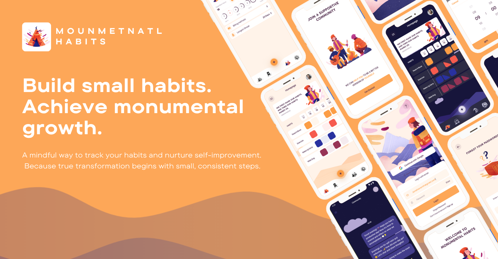

# 🌤️ Monumental Habits

> **Build small habits. Achieve monumental growth.**  
> A mindful way to track your habits and nurture self-improvement —  
> because true transformation begins with small, consistent steps.

---

## 🧠 Overview

**Monumental Habits** is a beautifully designed **habit tracking app** built with **Laravel** and **Flutter**, focused on helping users build consistency and mindfulness through clean UI and smooth functionality.

The app lets you **create, track, and visualize your daily habits**, while keeping you motivated with **reminders**, **progress tracking**, and a vibrant **community** space.

---

## ✨ Features

- 🪄 **Create and Manage Habits** — Add habits and track progress effortlessly.  
- ⏰ **Smart Local Notifications** — Gentle daily reminders to help you stay on track.  
- 🌙 **Light & Dark Mode** — Featuring our custom *Sky Cloudy* and *Dark Clouded* themes.  
- 📅 **Monthly Progress Tracking** — View your consistency and improvement visually across the month.  
- 👥 **Community Section** *(In Development)* — Connect, share progress, and chat with other users.  
- 🔐 **Google Sign-In** —  authentication with Google integration.  

---

## 🧩 Technologies Used

| Category            | Tools & Packages     |
|---------------------|----------------------|
| **Framework**       | Laravel              |   |
| **Authentication**  | Google Sign-In , JWT |
| **Database**        | MySql , PostgresSql  |   |
| **Version Control** | Git, GitHub          |
| **Real Time**       | reverb               |

---

## 🧑‍💻 Team 

**Frontend Developer & Designer:** [Yahea Dada](https://github.com/Dada6x)  
**Backend Developer:** [abd alrzaq najieb](https://github.com/ABDALRZAQ345)

---

